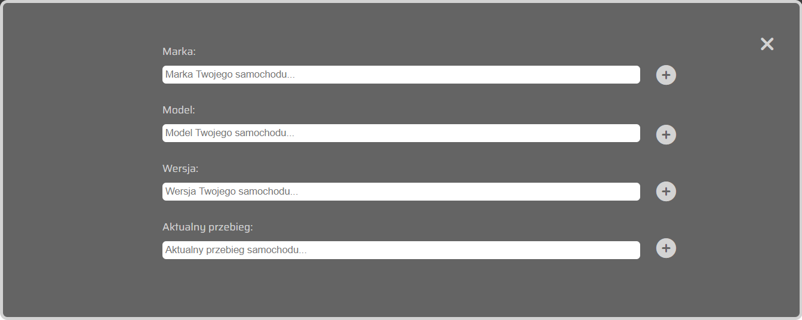
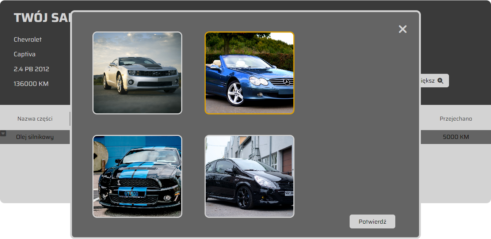
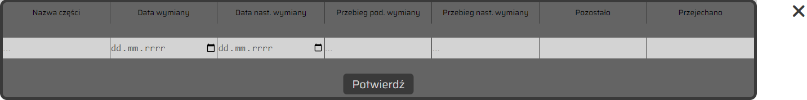

# Car Service App

Have you ever forgotten about a car service? Now you can keep everything about your car in one place.

https://tom-kola.github.io/CarServiceApp/

## The goal

This app was made to improve my JavaScript skills.

## What next about the app?

My next goal is to make this app responsive.

## Built with

<ul>
<li>HTML</li>
<li>CSS</li>
<li>JavaScript</li>
</ul>

## Features
 <ul>
 <li>Choose your car's avatar</li>
 <li>Enter your car details</li>
 <li>Enter each repair</li>
 <li>Possibility to add, delete and edit data</li>
 </ul>

 ## Project screenshots

### Main view
 

### Car details view
 

### Avatars view
 

### Adding a service
 
 